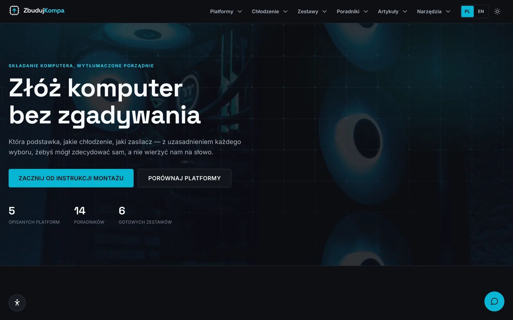
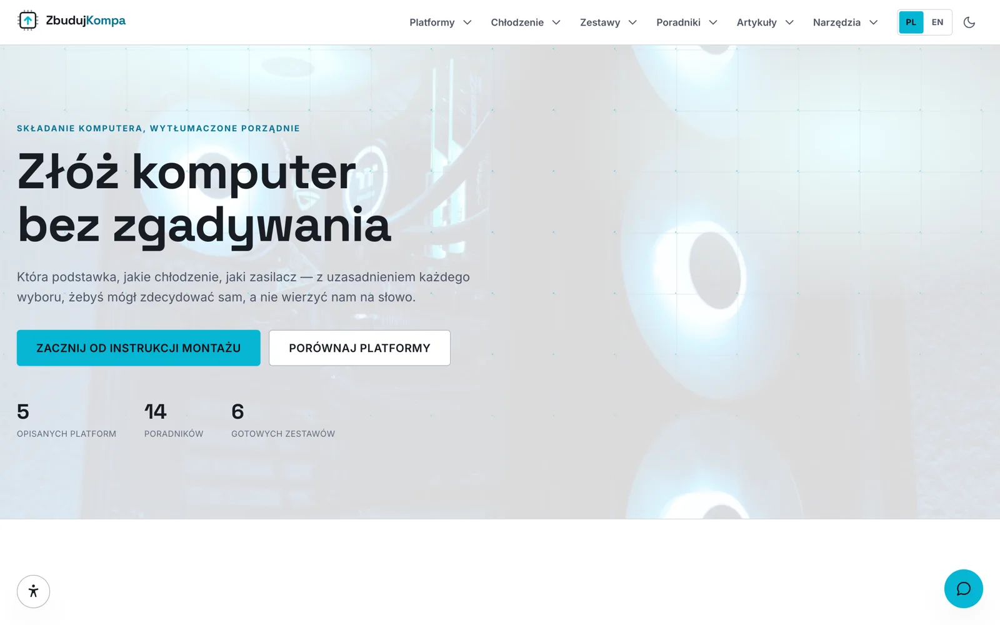
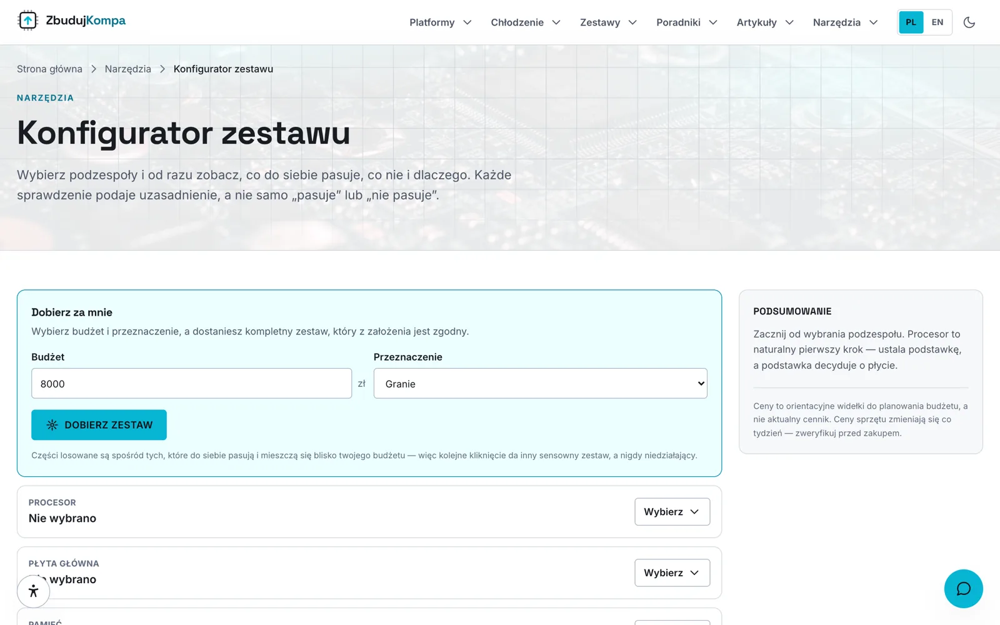
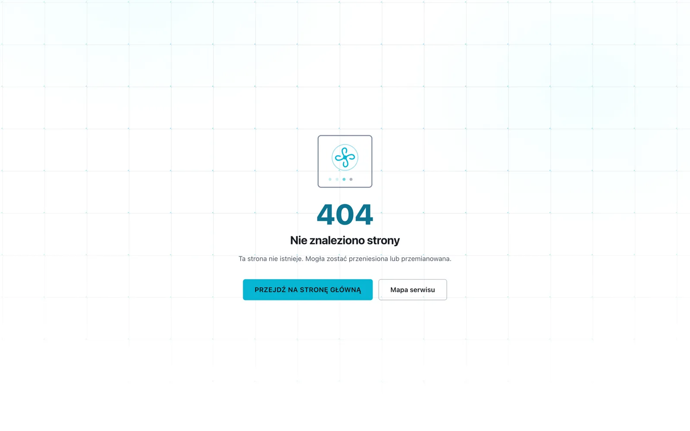

# ZbudujKompa

> 🚀 **Build your PC without guessing** - a bilingual, fully static reference site that explains the reasoning behind every hardware recommendation

**ZbudujKompa** is a reference site for anyone assembling a computer, published in Polish and English. It covers CPU platforms and sockets, cooling classes, a catalogue of real components, complete reference builds and step-by-step assembly guides — including installing Windows and Linux, which most build guides skip entirely. Each recommendation ships with the reasoning behind it rather than just the verdict.

There is no backend, no database and no tracking. Everything is prerendered to files and served by GitHub Pages. The interactive parts — the configurator, the calculators, the assistant — all run in the browser.

[](https://github.com/dawidolko/ZbudujKompa/actions/workflows/deploy.yml)


---

## 🎯 Key Features

- 🧩 **Configurator** — Pick parts from a catalogue of 96 components and get live compatibility checks: socket, memory generation, VRM capacity, physical clearances and supply headroom, each explaining its reasoning
- 🔩 **Components** — Every part carries a price band rather than a price, with the specifications that actually decide a build: cooler height, card length, module height
- 🖥️ **Platforms** — Five AMD and Intel sockets with chipset tables and an honest verdict on which are still worth buying into
- ❄️ **Cooling** — Five cooling classes compared on heat handled, noise and price, with the trade-offs stated plainly
- 📖 **Guides** — Fourteen step-by-step guides: assembly, first boot, BIOS, Windows and Linux installation, overclocking, quiet builds, diagnostics and maintenance
- 🧮 **Calculators** — Fourteen calculators covering supply sizing with ATX 3.x transients, physical clearance, running cost, acoustics, thermals, display bandwidth and memory latency, each showing its working
- 📰 **Articles** — Analysis, buying advice, news and explainers, with perishable pieces flagged by age rather than presented as current indefinitely
- 💬 **Assistant** — A docked chat assistant answering from a local knowledge base, with no API key required and an optional LLM layered on top
- 🌐 **Bilingual** — Every route exists in Polish and English with correct `hreflang`, `lang` and canonical URLs; Polish is the default
- 🎨 **Visuals** — Technical SVG diagrams, licensed photography, gradient background patterns and scroll animations that degrade to nothing without JavaScript
- ♿ **Accessible** — WCAG 2.2 Level AA in both light and dark themes, verified by an automated axe suite

---

## 🖼️ Screenshots

| Home page — dark theme                                                     | Home page — light theme                                                      |
| -------------------------------------------------------------------------- | ---------------------------------------------------------------------------- |
|  |  |

| Build configurator                                                                                                     | Assembly guides                                                                                          |
| ---------------------------------------------------------------------------------------------------------------------- | -------------------------------------------------------------------------------------------------------- |
|  |  |

Both themes meet WCAG 2.2 AA, and the choice survives a language switch.

---

## 🧩 Modules

| Module                  | Description                                                                                                       | Stack                                          |
| ----------------------- | ----------------------------------------------------------------------------------------------------------------- | ---------------------------------------------- |
| **Configurator**        | Part pickers, browser and comparison view, backed by the compatibility engine in `src/lib/parts/compatibility.ts` | React 19 client components, TypeScript         |
| **Calculators**         | Fourteen pure formula modules in `src/lib/calculators.ts`, testable without a browser                             | TypeScript                                     |
| **Chat assistant**      | Local knowledge base with an optional OpenAI-compatible provider on top                                           | `src/lib/chat`, `src/components/chat`          |
| **Guides & articles**   | Guide and blog content split by subject, rendered with anchored steps and diagrams                                | `src/lib/guides`, `src/lib/blog`               |
| **Diagrams**            | Hand-authored technical SVG drawings                                                                              | `src/components/diagrams`                      |
| **i18n**                | Locale config plus PL/EN dictionaries driving every route                                                         | `src/i18n`                                     |
| **Accessibility panel** | In-page preference panel with its own test suite                                                                  | `src/components/layout/AccessibilityPanel.tsx` |

---

## 🛠️ Technology Stack

### Frontend

- **Next.js 16** — App Router with a full static export (`output: 'export'`)
- **React 19** — Server and Client Components
- **TypeScript 5.7** — `strict` mode; a type error fails the production build
- **Tailwind CSS 4** — CSS-based configuration via `@tailwindcss/postcss`

### Tooling & Quality

- **ESLint 9** with `eslint-config-next`
- **Prettier 3** for formatting
- **Playwright** and **axe-core** (`@axe-core/playwright`) for browser and accessibility suites
- **sharp** for the photo optimisation pipeline

### Infrastructure

- **GitHub Actions** — verify → test → build → deploy on every push to `main`
- **GitHub Pages** — static hosting on a custom domain via `public/CNAME`
- **Docker** — three-stage build ending in an nginx runtime (`.tools/docker/`)
- **Node.js ≥ 22**

---

## 🚀 Getting Started

### Prerequisites

- **Node.js 22 or newer** (see `.nvmrc`)
- **npm**
- Optionally **Docker** for the containerised runtime

### 1. Clone the Repository

```bash
git clone https://github.com/dawidolko/ZbudujKompa.git
cd ZbudujKompa
```

### 2. Install Dependencies

```bash
npm ci          # install exactly what the lockfile pins
```

### 3. Run

```bash
npm run dev     # http://localhost:3000
```

Building and previewing the static export:

```bash
npm run build   # writes ./out
npm run serve   # http://localhost:3000
```

### Docker

```bash
npm run docker:up      # production image on http://localhost:8080
npm run docker:dev     # dev server with hot reload
npm run docker:down
npm run docker:logs
```

The production image is a three-stage build — dependencies, Next.js build, then an nginx runtime containing only the exported files. It runs as an unprivileged user with a read-only root filesystem. See [`.tools/docker/`](.tools/docker/).

### Configuration

Copy [`.env.example`](.env.example) to `.env.local`. Every variable is compiled into the static output, so treat all of them as public.

| Variable                   | Purpose                                                                          |
| -------------------------- | -------------------------------------------------------------------------------- |
| `NEXT_PUBLIC_SITE_URL`     | Canonical address used for metadata, Open Graph, structured data and the sitemap |
| `NEXT_PUBLIC_BASE_PATH`    | Sub-path prefix; empty for a custom domain, `/<repo>` for a project Pages site   |
| `NEXT_PUBLIC_CHAT_API_URL` | Optional OpenAI-compatible chat endpoint                                         |
| `NEXT_PUBLIC_CHAT_API_KEY` | Optional API key — see the warning below                                         |
| `NEXT_PUBLIC_CHAT_MODEL`   | Optional model name                                                              |

---

## 🧠 The Build Configurator

The [configurator](https://zbudujkompa.dawidolko.pl/pl/konfigurator/) is the piece with the most logic behind it. It re-checks on every change rather than behind a submit button, so a conflict appears while the choice that caused it is still on screen.

Findings come in three grades, and the middle one is the point:

- **Error** — the build cannot work. A DDR4 kit will not enter a DDR5 slot.
- **Warning** — it works, but something is compromised. A board whose VRM is below the CPU's peak draw does not fail; it quietly reduces clocks under sustained load, which is exactly the kind of problem nobody notices.
- **Pass** — checked and fine, stated explicitly so the reader knows it was considered.

Every message explains itself. `Incompatible` on its own sends someone back to a forum; _"this board takes DDR5 and that kit is DDR4"_ tells them what to change.

The engine lives in [`src/lib/parts/compatibility.ts`](src/lib/parts/compatibility.ts) and is covered by [15 tests](tests/compatibility.spec.mjs).

---

## 💬 The Chat Assistant

The assistant in the bottom-right corner matches questions against a knowledge base compiled into the site. **It works offline, costs nothing per message, and needs no API key.**

An optional LLM can be layered on top with a free-tier key from [Groq](https://console.groq.com/keys), [OpenRouter](https://openrouter.ai/keys) or [Cerebras](https://cloud.cerebras.ai):

```bash
npm run chat:key -- gsk_your_key_here    # verifies the key, then writes .env.local
npm run dev
```

**Any failure falls back to the local answer** — rate limit, bad key, no network, or a 15-second timeout. The assistant never stops answering.

> **Before adding a key to a public deployment.** This is a static export. A GitHub Secret is secret in the Actions log, not in the built site: the value is compiled into the JavaScript bundle and served to every visitor. Only use a free-tier key, with a hard spending limit, that you are prepared to rotate. `npm run check:secrets` scans tracked files for keys and runs first in CI.

To enable it on Pages, add `CHAT_API_URL`, `CHAT_API_KEY` and `CHAT_MODEL` as repository secrets. Leaving them unset is fully supported.

---

## ♿ Accessibility

The site targets WCAG 2.2 Level AA. [`tests/a11y.spec.mjs`](tests/a11y.spec.mjs) runs axe against a page from every section **in both themes** — a contrast failure can exist in one theme and not the other, so a single-theme audit misses half of them.

- Every text/background pair is documented with its measured contrast ratio in [`globals.css`](src/app/globals.css), so a future change can be checked against the number it has to beat.
- Colour is never the sole carrier of meaning: every status pairs colour with an icon and a text label.
- Focus is always visible, meets the 3:1 indicator contrast of SC 2.4.13, and returns to the triggering control when a panel closes.
- `prefers-reduced-motion`, `prefers-contrast` and `forced-colors` are all honoured. Scroll animations are gated on JavaScript being available, so content is never left invisible.
- Interactive targets meet the 44×44 minimum of SC 2.5.8.
- An in-page [accessibility panel](src/components/layout/AccessibilityPanel.tsx) exposes the preferences directly, with its own suite in `tests/accessibility-panel.spec.mjs`.

Automated testing catches roughly a third of accessibility problems. Passing the suite is a floor, not a certificate — known gaps are listed on the site's own [accessibility page](https://zbudujkompa.dawidolko.pl/pl/dostepnosc/), served from `src/app/[locale]/dostepnosc/`.

---

## 🧪 Testing

```bash
npm run verify   # secrets, typecheck, lint, formatting, build
npm run test     # chat, compatibility, calculators, theme, a11y panel, interaction, accessibility
```

The browser suites need a built site running — `npm run build && npm run serve` first, or point them elsewhere with `TEST_BASE_URL`.

| Suite                                | Covers                                                                                  |
| ------------------------------------ | --------------------------------------------------------------------------------------- |
| `tests/chat.spec.mjs`                | Question matching in both languages, including off-topic questions that must be refused |
| `tests/compatibility.spec.mjs`       | The configurator engine: sockets, memory, power, physical fit                           |
| `tests/calculators.spec.mjs`         | Every calculator formula, without a browser                                             |
| `tests/theme.spec.mjs`               | Theme persistence across language switches, and no flash on load                        |
| `tests/accessibility-panel.spec.mjs` | The in-page accessibility preferences panel                                             |
| `tests/interaction.spec.mjs`         | Menu, assistant, calculators, glossary filter                                           |
| `tests/a11y.spec.mjs`                | axe against every section, in both themes                                               |

Individual suites are also available as `npm run test:chat`, `test:compat`, `test:calc`, `test:theme`, `test:a11ypanel`, `test:interaction` and `test:a11y`.

---

## 📁 Project Structure

```
ZbudujKompa/
├── .github/workflows/     # CI: verify → test → build → deploy
├── .tools/
│   ├── docker/            # Dockerfile, compose, nginx, security headers
│   └── scripts/           # Brand assets, photo pipeline, chat key, secret scanning
├── docs/screenshots/      # README imagery
├── public/                # Icons, OG image, photos, videos, manifest, CNAME
├── src/
│   ├── app/
│   │   ├── [locale]/      # Every content route, both languages
│   │   ├── globals.css    # Design tokens with documented contrast ratios
│   │   ├── robots.ts
│   │   └── sitemap.ts
│   ├── components/
│   │   ├── blog/          # Article rendering
│   │   ├── chat/          # Build assistant
│   │   ├── configurator/  # Part pickers, browser and comparison
│   │   ├── diagrams/      # Technical SVG drawings
│   │   ├── layout/        # Header, footer, theme, language, accessibility panel
│   │   ├── motion/        # Scroll-reveal wrapper
│   │   ├── tools/         # Calculators and utilities
│   │   └── ui/            # Buttons, badges, cards, photos, icons
│   ├── i18n/              # Locale config and PL/EN dictionaries
│   └── lib/
│       ├── parts/         # Component catalogue and compatibility engine
│       ├── blog/          # Articles and news
│       ├── chat/          # Knowledge base and provider
│       ├── guides/        # Guide content, split by subject
│       ├── calculators.ts # Every formula, testable without a browser
│       └── theme.ts       # Theme resolution and persistence
└── tests/                 # Chat, compatibility, calculators, theme, interaction, a11y
```

### Three decisions worth knowing

**The document shell lives in `[locale]/layout.tsx`, not the root layout.** The `lang` attribute has to be correct in the _served_ HTML, and the locale segment is the only place that knows the language.

**Navigation, sitemap and routes derive from the data modules.** Adding a socket to `src/lib/sockets.ts` puts it in the menu, the footer, the sitemap and its own generated page. There is no second list to keep in step.

**The theme is an attribute, re-applied after navigation.** Each locale renders its own `<html>`, and Next.js treats a link between them as a client-side navigation — so the new document's `<head>` script never runs and React drops the attribute. A blocking script handles the cold load and [`ThemeScript`](src/components/layout/ThemeScript.tsx) handles the soft navigation. Both halves are needed; [five tests](tests/theme.spec.mjs) cover the combinations.

---

## 🚢 Deployment

Pushing to `main` runs [`deploy.yml`](.github/workflows/deploy.yml): verify → test → build → deploy. The deploy depends on the tests, so a build that fails typecheck, lint, formatting or accessibility never reaches production.

For a project site at `https://<user>.github.io/<repo>/`, set `NEXT_PUBLIC_BASE_PATH=/<repo>`. On a custom domain — as here, via `public/CNAME` — leave it empty.

---

## 🌍 Live Demo

The project is deployed and available at: **[https://zbudujkompa.dawidolko.pl](https://zbudujkompa.dawidolko.pl)**

---

## 🤝 Contributing

Corrections to the technical content are especially welcome; hardware advice ages, and an issue pointing at something now wrong is genuinely useful. Please keep commits following [Conventional Commits](https://www.conventionalcommits.org/) and run `npm run verify` before opening a pull request.

Photographs are credited in [`public/photos/CREDITS.md`](public/photos/CREDITS.md) and used under the [Unsplash Licence](https://unsplash.com/license).

---

## 📄 License

This project is open source and available under the [MIT License](LICENSE).

---

## 👨‍💻 Author

Created by **[Dawid Olko](https://github.com/dawidolko)**

- **Website** — [dawidolko.pl](https://dawidolko.pl/)
- **LinkedIn** — [@dawidolko](https://www.linkedin.com/in/dawidolko/)
